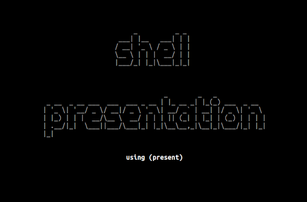

# Shell presentation

Have Python/pip installed.

Install [`present`](https://pypi.org/project/present/).

```sh
$ pip install present
```

Run.

```sh
$ present present.md
```

## Screenshot

This is how it looks like:


